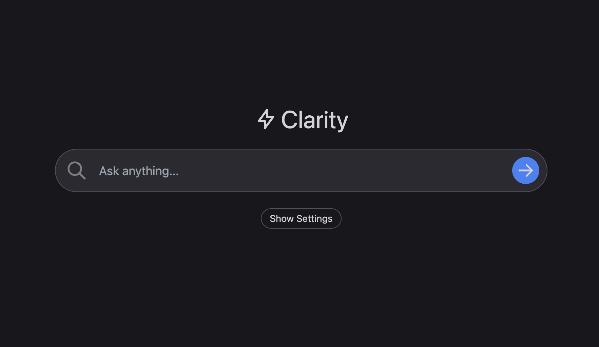

# Vsearch

Vsearch is an advanced AI-powered search engine that provides accurate answers with cited sources. It's inspired by [perplexity.ai](https://www.perplexity.ai/) but uses the Cerebras API with the llama-4-scout-17b-16e-instruct model for processing data and generating AI responses.

[](https://vsearch.vercel.app/)

## Features

- **Multiple Search Engines**: Get results from Google, Bing, DuckDuckGo, or all combined
- **Advanced Web Scraping**: Intelligent content extraction with multiple techniques
- **Source Citations**: All answers include citations to original sources
- **Follow-up Questions**: Ask follow-up questions in a conversational interface
- **Dark/Light Mode**: Choose your preferred theme or use system settings
- **Voice Input**: Search using voice commands
- **Mobile Responsive**: Works great on all devices

## How It Works

Vsearch provides accurate, up-to-date information by combining web search with AI processing:

1. User submits a query (text or voice)
2. Vsearch fetches results from selected search engines
3. Advanced web scraping extracts relevant content from sources
4. Content is processed and prioritized based on quality
5. The Cerebras llama-4-scout model generates a comprehensive answer with citations
6. Results are displayed with links to original sources
7. Users can ask follow-up questions to continue the conversation

## Architecture

The application is built with a modular architecture:

- **Frontend**: Next.js with TypeScript and Tailwind CSS
- **Backend**: Next.js API routes for server-side processing
- **AI Integration**: Cerebras API with llama-4-scout-17b-16e-instruct model
- **Search**: Custom implementations for Google, Bing, and DuckDuckGo
- **Content Extraction**: Multiple techniques for different website types
- **Error Handling**: Robust fallback mechanisms and recovery

## Running Locally

1. Clone the repository

```bash
git clone https://github.com/Hadi-jawdi/Vsearch.git
cd Vsearch
```

2. Install dependencies

```bash
npm install
```

3. Run the development server

```bash
npm run dev
```

4. Open [http://localhost:3000](http://localhost:3000) in your browser

## Key Components

- **Search Engines**: Modular implementations for Google, Bing, and DuckDuckGo
- **Content Extraction**: Multiple techniques for different website types
- **Web Scraping**: Advanced scraping with error handling and fallbacks
- **User Preferences**: Theme and search engine preferences
- **History Management**: Save and retrieve search history

## Technologies Used

- **Next.js**: React framework for frontend and API routes
- **TypeScript**: Type-safe code
- **Tailwind CSS**: Utility-first CSS framework
- **Cerebras API**: AI model for answer generation
- **Cheerio**: HTML parsing for web scraping
- **JSDOM**: DOM implementation for content extraction
- **Mozilla Readability**: Content extraction algorithm

## Future Improvements

- [ ] Add more search engines
- [ ] Implement search history synchronization
- [ ] Enhance mobile experience
- [ ] Add export functionality for answers
- [ ] Implement user accounts for personalized experience
- [ ] Add more language support

## Credits

This project is a fork of [Clarity AI](https://github.com/mckaywrigley/clarity-ai) by McKay Wrigley, with significant enhancements and modifications.

Special thanks to:
- [Cerebras](https://www.cerebras.net/) for their powerful llama-4-scout model
- [Mozilla Readability](https://github.com/mozilla/readability) for content extraction
- [Perplexity AI](https://www.perplexity.ai/) for the inspiration
